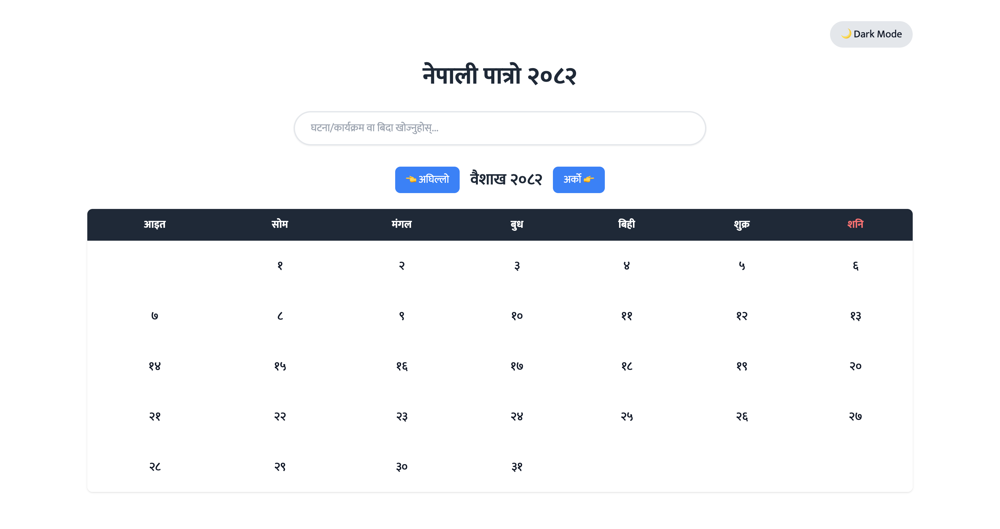
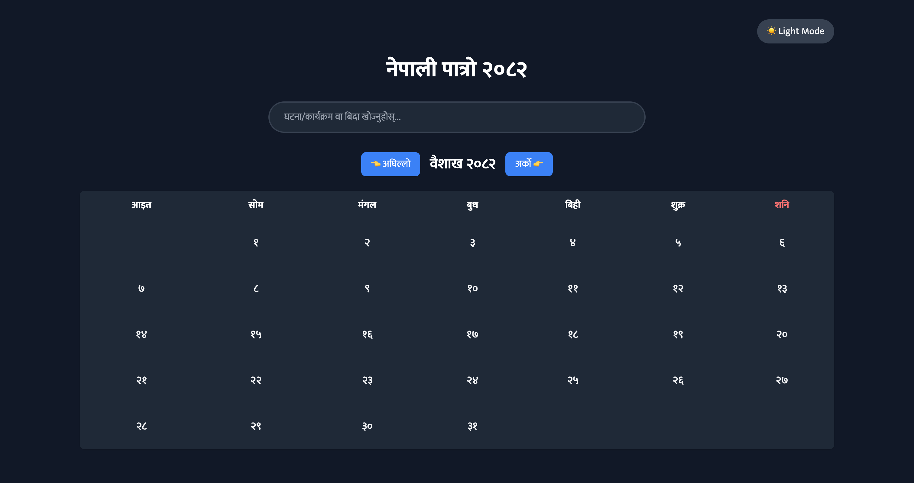

# Nepali Calendar (नेपाली पात्रो २०८२)

A web-based Nepali Calendar application that displays the Nepali calendar for the year 2082 BS with holidays and events.

## Theme Preview

### Light Mode

### Dark Mode

## Features

- 📅 Complete Nepali Calendar for 2082 BS
- 🌙 Dark/Light mode toggle
- 🔍 Search functionality for events and holidays
- 📱 Responsive design for all devices
- 🎯 Interactive date selection
- 📌 Holiday and event display
- 🇳🇵 Devanagari number system

## Technologies Used

- HTML5
- Tailwind CSS
- JavaScript

## Getting Started

1. Clone the repository
2. Open `index.html` in your web browser

## Project Structure

### Calendar Navigation
- Navigate between months using arrow buttons
- Month title displayed in Devanagari script

### Date Display
- Dates shown in Devanagari numerals
- Special highlighting for Saturdays
- Interactive date selection

### Events and Holidays
- Important national holidays marked
- Custom events support
- Modal display for holiday details

### Search Functionality
- Search through events and holidays
- Real-time search results

### Theme Toggle
- Switch between light and dark modes
- Persistent theme preference

## Contributing

Contributions are welcome! Please feel free to submit a Pull Request.

## License

This project is open source and available under the MIT License.